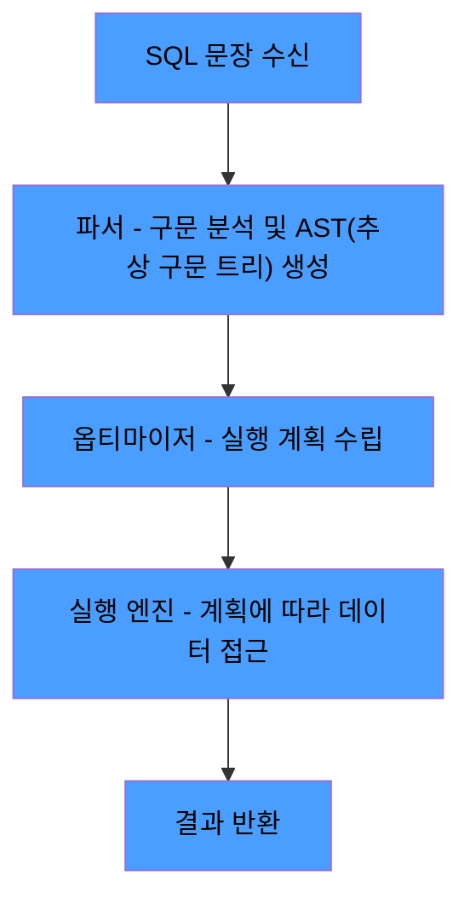
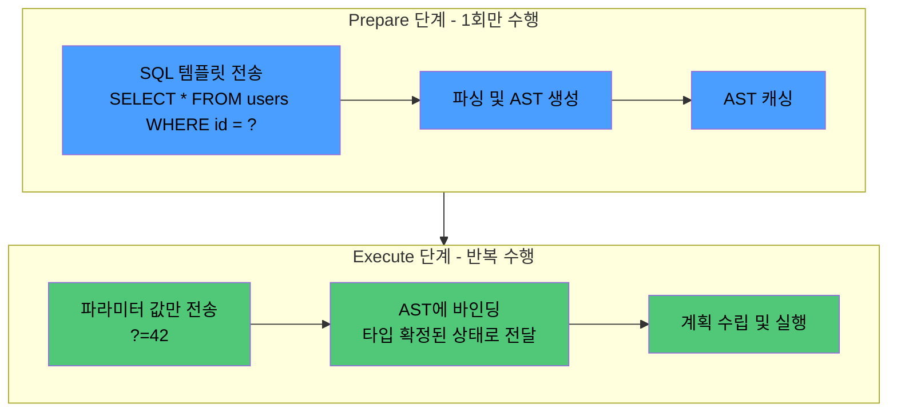

# SQL이란

SQL(Structured Query Language)은 관계형 데이터베이스에서 데이터를 정의, 조작, 제어하기 위한 선언적(Declarative) 언어다.

- 1970년 E.F. Codd가 발표한 관계 모델(Relational Model) 이론에서 출발
- IBM System R 프로젝트에서 SEQUEL(Structured English Query Language)로 최초 구현
- 이후 ANSI/ISO 표준으로 제정되어 현재까지 발전 (SQL-92, SQL:1999, SQL:2016 등)

## 선언적 언어의 특성

SQL은 "무엇을(What)" 요청하는 언어이지, "어떻게(How)" 수행할지를 지시하는 언어가 아니다.

```sql
-- SQL: "30세 이상 사용자를 달라"
SELECT *
FROM users
WHERE age >= 30;
```

이 분리 덕분에 동일한 SQL 문장이라도 내부 실행 방식이 완전히 달라질 수 있다.

- 데이터가 100건일 때: 옵티마이저가 Full Table Scan(테이블 전체를 순차 스캔)을 선택 — 인덱스 탐색 비용이 오히려 큼
- 데이터가 100만건이고 age에 인덱스가 있을 때: 옵티마이저가 Index Range Scan(인덱스에서 조건 범위만 탐색 후 레코드 접근)을 선택
- 개발자는 SQL을 바꾸지 않았지만, DBMS가 상황에 맞는 최적의 실행 경로를 자동으로 결정

## SQL 표준과 방언(Dialect)

ANSI/ISO SQL 표준이 존재하지만, 각 DBMS는 자체 확장을 포함한다.

|   기능   |             표준 SQL             |                   벤더 확장 예시                    |
|:------:|:------------------------------:|:---------------------------------------------:|
| 문자열 결합 |           `\|\|` 연산자           |      MySQL: `CONCAT()`, SQL Server: `+`       |
|  행 제한  |      `FETCH FIRST n ROWS`      |       MySQL: `LIMIT`, Oracle: `ROWNUM`        |
| 자동 증가  | `GENERATED ALWAYS AS IDENTITY` | MySQL: `AUTO_INCREMENT`, PostgreSQL: `SERIAL` |

표준 SQL로 작성하면 이식성이 높아지지만, 실무에서는 특정 DBMS의 확장 문법을 사용하는 경우가 대부분이다.

## SQL 문장의 내부 처리 흐름

"어떻게"를 DBMS에 맡긴다는 것은, 실제 실행 경로를 내부에서 매번 다시 결정한다는 뜻이다.



각 단계의 역할은 다음과 같다.

- 파서(Parser): SQL 문자열의 구문을 검증하고 AST(Abstract Syntax Tree, 추상 구문 트리)를 생성
    - 구조적 정확성만 검증하며, 존재하지 않는 테이블 같은 의미적 오류는 이 단계에서 잡지 못함
- 옵티마이저(Optimizer): 파서가 생성한 AST를 기반으로 여러 실행 계획 후보를 생성하고, 통계 정보(행 수, 카디널리티(컬럼 값의 중복도), 인덱스 유무)를 기반으로 비용이 가장 낮은 계획을 선택
- 실행 엔진(Execution Engine): 선택된 계획에 따라 스토리지 엔진을 호출하여 데이터를 읽고 결과를 반환

## SQL의 논리적 처리 순서 vs 작성 순서

SQL은 작성 순서와 처리 순서가 다르게 설계되어 있으며, 이로 인해 특정 구문에서 다른 구문의 별칭을 참조할 수 없는 등의 동작이 발생한다.

- 작성 순서: `SELECT` → `FROM` → `WHERE` → `GROUP BY` → `HAVING` → `ORDER BY`
- 논리적 처리 순서: `FROM` → `ON` → `JOIN` → `WHERE` → `GROUP BY` → `HAVING` → `SELECT` → `DISTINCT` → `ORDER BY` → `LIMIT`

두 순서가 다르기 때문에 아래와 같은 동작이 나타난다.

- `WHERE`에서 `SELECT`의 별칭을 참조할 수 없는 이유: `SELECT`가 `WHERE`보다 나중에 처리됨
- `GROUP BY` 이후에만 `HAVING`이 동작하는 이유: `HAVING`이 `GROUP BY` 직후에 처리됨
- `ORDER BY`에서는 `SELECT` 별칭을 쓸 수 있는 이유: `ORDER BY`가 `SELECT` 이후에 처리됨

** 논리적 처리 순서로, 실제 옵티마이저가 실행하는 순서와는 다르다. 옵티마이저는 상황에 따라 논리적 순서를 재배치하여 최적의 실행 계획을 수립한다.

## Prepared Statement

Prepared Statement는 파싱 비용을 최적화하는 메커니즘으로, SQL의 구조(AST)와 데이터(파라미터)를 분리한다.



핵심은 구조와 데이터의 분리에 있다.

- Prepare 단계: `SELECT * FROM users WHERE id = ?` → 파서가 AST를 생성하고 `?` 위치를 플레이스홀더로 고정
- Execute 단계: `?`에 실제 값(42)이 바인딩 → 이 값은 AST 구조를 변경할 수 없고, 리터럴 데이터로만 취급
- 동일 구조의 쿼리를 반복 실행할 때 파싱 비용을 절약

### MySQL에서 직접 다루기

MySQL은 SQL 구문으로 prepared statement를 직접 제어할 수 있다.

```sql
PREPARE stmt FROM 'SELECT * FROM users WHERE id = ?';
SET @id = 42;
EXECUTE stmt USING @id;
DEALLOCATE PREPARE stmt;
```

- PREPARE된 statement는 해당 세션 내에서만 유효하며, DEALLOCATE 또는 세션 종료 시 소멸
- 서버 전역 `max_prepared_stmt_count`(기본 16,382)로 전체 개수 제한, 초과 시 새로운 PREPARE가 거부됨

### 캐싱 효과는 실제로 있는가

단순 쿼리(`SELECT ... WHERE id = ?`) 2만 회 반복 사례를 비교하면 다음과 같은 결과가 나온다.

|              조건              | 실행 시간 |
|:----------------------------:|:-----:|
|    한 번 PREPARE 후 끝까지 재활용     | 약 4분  |
| 매 실행마다 PREPARE/DEALLOCATE 반복 | 약 21분 |
|     PREPARE 없이 일반 쿼리로 실행     | 약 4분  |

- 단순 쿼리는 MySQL 파싱 비용 자체가 작아, 재활용과 일반 실행 사이 차이가 거의 없음
- 매 실행마다 PREPARE/DEALLOCATE를 반복하면 등록/해제 오버헤드가 누적되어 오히려 가장 느려짐

따라서 Prepared Statement가 성능상 의미를 갖는 조건은 명확하다.

- 파싱/최적화 비용이 큰 쿼리 (다중 JOIN, 서브쿼리 등)
- 세션 내에서 PREPARE된 statement를 실제로 반복 재사용

참고: [우리의 애플리케이션에서 PreparedStatement는 어떻게 동작하고 있는가](https://tech.kakaopay.com/post/how-preparedstatement-works-in-our-apps/)
