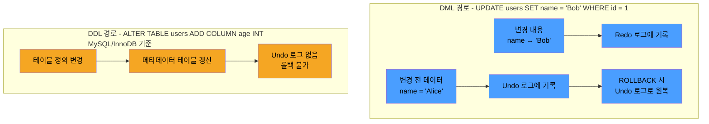

# DDL, DML, DCL이란

SQL 명령어 자체를 역할별로 분류해보면 네 가지로 나뉜다.

|                 분류                 |    정의     |             대표 명령어             |      대상       |
|:----------------------------------:|:---------:|:------------------------------:|:-------------:|
|   DDL (Data Definition Language)   | 데이터 구조 정의 | CREATE, ALTER, DROP, TRUNCATE  | 테이블, 인덱스, 뷰 등 |
|  DML (Data Manipulation Language)  |  데이터 조작   | SELECT, INSERT, UPDATE, DELETE |  행(Row) 데이터   |
|    DCL (Data Control Language)     | 접근 권한 제어  |         GRANT, REVOKE          |    사용자 권한     |
| TCL (Transaction Control Language) |  트랜잭션 제어  |  COMMIT, ROLLBACK, SAVEPOINT   |     트랜잭션      |

## DDL의 특수성 - 암묵적 커밋

DDL은 DML과 달리 테이블 구조 자체를 변경하는 명령이기 때문에, 트랜잭션 처리 방식도 다르다.

- MySQL, Oracle 등 대부분의 DBMS에서 DDL 명령은 실행 시 암묵적으로 COMMIT이 수행
- PostgreSQL은 트랜잭션 내 DDL을 지원하므로 DDL 실행 후에도 ROLLBACK이 가능

```sql
START TRANSACTION;

INSERT INTO users (name)
VALUES ('Alice');
-- Alice는 아직 커밋되지 않은 상태

ALTER TABLE users
    ADD COLUMN phone VARCHAR(20);
-- DDL 실행 → 암묵적 COMMIT 발생 → Alice INSERT도 함께 커밋됨

ROLLBACK;
-- 이미 커밋되었으므로 Alice 데이터는 롤백되지 않음
```

## DML과 DDL의 내부 처리 차이

DDL이 왜 암묵적으로 커밋되고 롤백이 제한되는지의 이유는 내부 처리 방식의 차이에서 나온다.

- Undo 로그: 변경 전의 데이터를 기록해 두어 ROLLBACK 시 원상태로 되돌리는 데 사용
- Redo 로그: 변경 후의 데이터를 기록해 두어 크래시 발생 시 이미 커밋된 변경을 재적용하는 데 사용



1. 물리적 재구성 발생
    - 테이블스페이스(테이블·인덱스 데이터가 실제로 저장되는 물리 공간)에 새 컬럼 공간을 확보하고 기존 레코드를 새 포맷으로 재작성한다. 인덱스도 재구성
2. 의존 객체 연쇄
    - 새 스키마를 참조하는 뷰, 외래키, 트리거, 저장 프로시저, 실행 계획 캐시에 영향
    - 롤백을 위해선 이 연쇄 변경을 모두 역순으로 처리 필요

## TRUNCATE vs DELETE

DDL과 DML의 처리 차이를 가장 잘 보여주는 사례가 TRUNCATE(DDL)와 DELETE(DML)의 비교다.

```sql
-- 시나리오: 100만 행이 있는 logs 테이블을 비워야 함

-- DELETE: 행 단위로 삭제
DELETE
FROM logs;
```

- 100만 개의 행을 하나씩 방문하며 삭제 마킹
- 각 행마다 Undo 로그 레코드 생성 (롤백 대비)
- 각 행마다 Redo 로그 레코드 생성 (크래시 복구 대비)
- DELETE 트리거가 정의되어 있으면 행마다 트리거 실행
- 결과: 트랜잭션 로그 폭증, 디스크 I/O 부하, 수 분~수십 분 소요 가능
- ROLLBACK 가능

```sql
-- TRUNCATE: 페이지 할당 해제
TRUNCATE TABLE logs;
```

- 테이블의 데이터 페이지 할당 자체를 해제 (실제 데이터를 하나씩 지우지 않음)
- 페이지 포인터만 제거하여 해당 공간을 "빈 것"으로 마킹
- 로그 최소화 (개별 행이 아닌 페이지 단위 기록)
- 결과: 거의 즉시 완료
- MySQL, Oracle: ROLLBACK 불가 (DDL이므로 암묵적 커밋)

|       구분       |   DELETE (DML)    |          TRUNCATE (DDL)          |
|:--------------:|:-----------------:|:--------------------------------:|
|     동작 방식      | 행 단위 삭제 + Undo 로그 |            페이지 할당 해제             |
|    WHERE 조건    |        가능         |           불가 (전체 삭제만)            |
|       롤백       |        가능         | MySQL/Oracle: 불가, PostgreSQL: 가능 |
|     트리거 실행     |        실행됨        |              실행 안 됨              |
| AUTO_INCREMENT |        유지         |               초기화                |
|  속도 (100만 행)   |        수 분        |              수 초 이내              |
