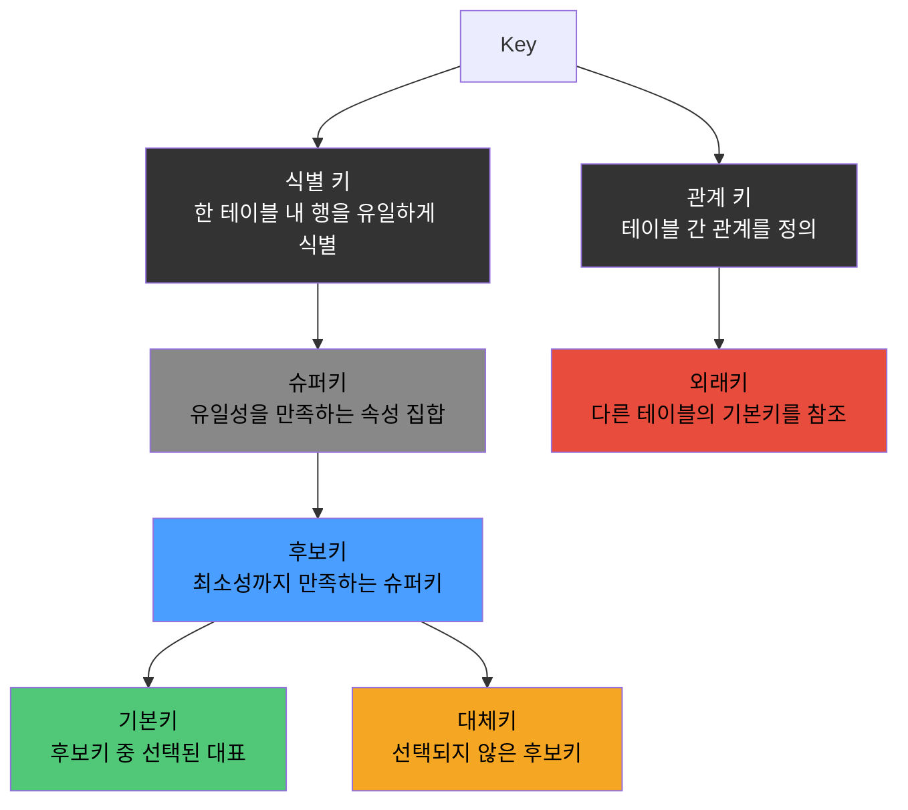

# Key란

Key는 테이블의 행을 식별하거나 테이블 간 관계를 정의하기 위한 속성 또는 속성의 집합으로, 역할에 따라 크게 두 갈래로 나뉜다.

## Key의 계층 구조



## 식별 키

먼저 식별 키부터 살펴본다. 아래 테이블을 예로 든다.

```sql
-- 학생 테이블
CREATE TABLE students
(
    student_id  INT,
    resident_id CHAR(13), -- 주민등록번호
    name        VARCHAR(50),
    department  VARCHAR(50)
);
```

각 식별 키 유형을 위 테이블에 대입하면 다음과 같다.

- 슈퍼키(Super Key): 유일성을 만족하는 속성의 모든 조합
    - {student_id}, {resident_id}, {student_id, name}, {student_id, name, department}, ...
    - 불필요한 속성이 포함되어도 유일성만 만족하면 슈퍼키
- 후보키(Candidate Key): 슈퍼키 중 최소성을 만족하는 것
    - {student_id}, {resident_id}
    - {student_id, name}은 유일하지만 student_id만으로도 유일하므로 최소성 불만족 → 슈퍼키이지만 후보키는 아님
- 기본키(Primary Key): 후보키 중 대표로 선택된 하나로, 식별자 역할을 하는 키
    - {student_id}를 기본키로 선택 → NOT NULL 제약 자동 적용
- 대체키(Alternate Key): 기본키로 선택되지 않은 나머지 후보키
    - {resident_id} → UNIQUE 제약을 걸어 유일성을 보장

## 자연키 vs 대리키

기본키를 정할 때에는 크게 두 가지 선택지가 있다.

| 구분 |   자연키 (Natural Key)   | 대리키 (Surrogate Key)  |
|:--:|:---------------------:|:--------------------:|
| 정의 |   비즈니스 의미를 가진 실제 속성   |   시스템이 생성한 인공적 식별자   |
| 예시 |      주민등록번호, 이메일      | AUTO_INCREMENT, UUID |
| 장점 |   의미가 명확, 별도 생성 불필요   | 불변, 단일 컬럼, 조인 비용 낮음  |
| 단점 | 값 변경 가능성, 복합키 시 조인 비용 |      비즈니스 의미 없음      |

```sql
-- 주민등록번호를 PK로 사용한 경우
CREATE TABLE users
(
    resident_id CHAR(13) PRIMARY KEY,
    name        VARCHAR(50)
);

CREATE TABLE orders
(
    id               BIGINT PRIMARY KEY,
    user_resident_id CHAR(13) REFERENCES users (resident_id) -- FK
);

-- 문제 1: 법적으로 주민번호가 변경되는 경우 (성별 정정, 개명 등)
-- → users PK 변경 + orders FK 전부 갱신 필요 → CASCADE 연쇄 비용

-- 문제 2: 외국인 등록번호 체계 추가
-- → CHAR(13)으로 담을 수 없는 포맷 → 스키마 변경 필요

-- 문제 3: 개인정보 보호
-- → PK가 모든 FK에 노출 → 주민번호가 여러 테이블에 산재

-- 대안: 일반적 패턴은 대리키를 PK로, 자연키에 UNIQUE 제약
CREATE TABLE users
(
    id          BIGINT AUTO_INCREMENT PRIMARY KEY, -- 대리키 (PK)
    email       VARCHAR(255) NOT NULL UNIQUE,      -- 자연키 (대체키)
    resident_id CHAR(13) UNIQUE,                   -- 자연키 (대체키, NULL 허용)
    name        VARCHAR(100) NOT NULL
);
```
