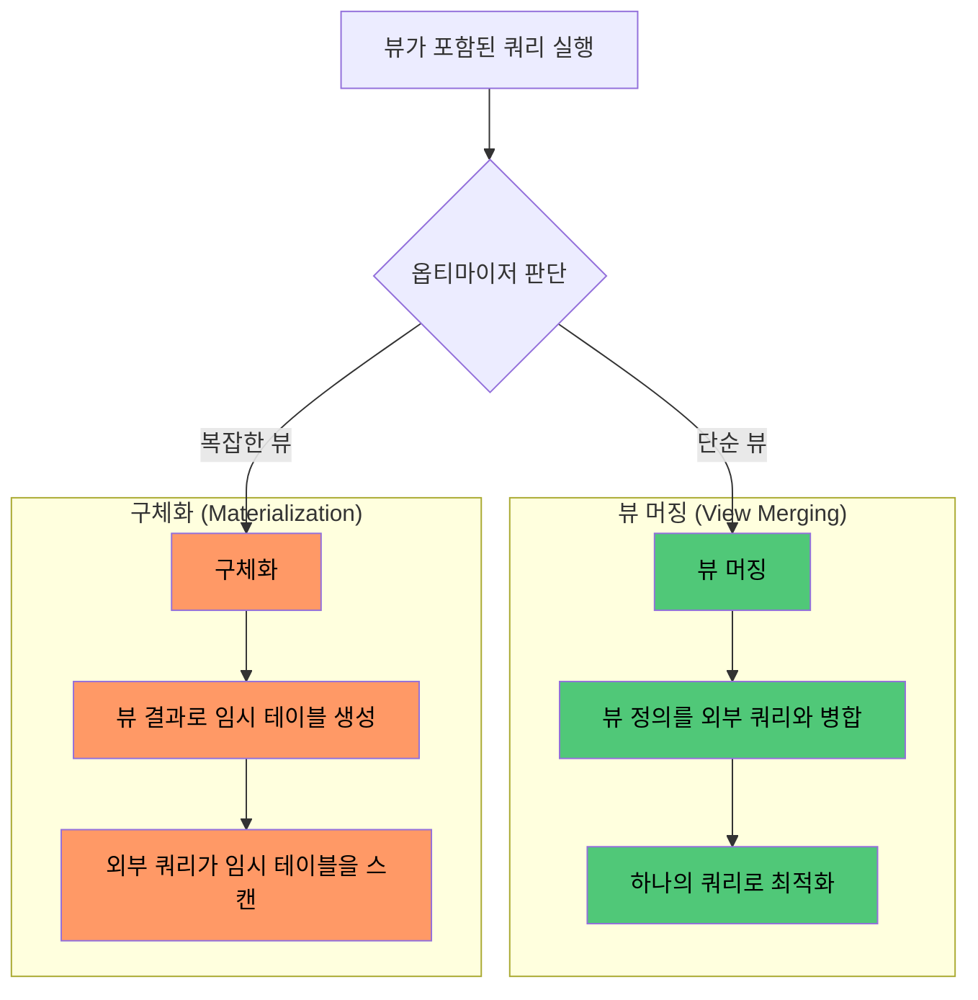

# View란

뷰(View)는 저장된 데이터를 다양한 관점에서 바라보기 위한 가상 테이블로, 실제 데이터를 갖지 않고 SELECT 문만 저장하여 조회 시마다 원본 테이블에서 결과를 가져온다.

```sql
-- 뷰 생성: SELECT 문을 이름 붙여 저장
CREATE VIEW active_users AS
SELECT id, name, email
FROM users
WHERE status = 'ACTIVE';

-- 뷰 사용: 일반 테이블처럼 SELECT 가능
SELECT *
FROM active_users
WHERE name LIKE 'Kim%';
```

## 뷰와 유사 개념 비교

|      구분      | 데이터 저장 |     생존 범위     |   재사용   |     용도      |
|:------------:|:------:|:-------------:|:-------:|:-----------:|
|     테이블      | 물리적 저장 |      영구       |   자유    |  실제 데이터 보관  |
|      뷰       | 쿼리만 저장 | 영구 (DROP 전까지) |   자유    | 복잡한 쿼리 캡슐화  |
| 서브쿼리 (인라인 뷰) | 저장 안 함 |  해당 쿼리 실행 중   |   불가    | 일회성 파생 데이터  |
|    임시 테이블    | 물리적 저장 |  세션 또는 트랜잭션   | 세션 내 자유 | 중간 결과 임시 보관 |

## 뷰의 내부 처리 방식

뷰를 조회하면 옵티마이저는 두 가지 전략 중 하나를 선택한다.



뷰 머징이 성공하면 뷰 정의와 외부 쿼리가 하나로 합쳐져 원본 테이블의 인덱스를 직접 활용한다.

```sql
-- active_users 뷰에 WHERE name = 'Kim' 조건으로 조회 시
-- 옵티마이저가 병합한 결과:
SELECT id, name, email
FROM users
WHERE status = 'ACTIVE'
  AND name = 'Kim';
-- → 인덱스가 있다면 효율적으로 조회
```

GROUP BY, DISTINCT, UNION 등이 포함된 복잡한 뷰는 머징이 불가능하여 구체화가 발생한다.
쿼리 실행 시마다 뷰 결과로 임시 테이블을 새로 생성한 뒤 외부 쿼리가 이를 스캔하므로 머징 대비 오버헤드가 있다.

## Materialized View

일반 뷰와 달리 쿼리 결과를 물리적으로 저장하는 뷰다.

|   구분    |    일반 뷰     |      Materialized View      |
|:-------:|:-----------:|:---------------------------:|
| 데이터 저장  |   쿼리만 저장    |        결과를 물리적으로 저장         |
|  조회 성능  | 매번 원본 쿼리 실행 |       사전 계산된 결과 즉시 반환       |
| 데이터 신선도 |    항상 최신    |       갱신 전략에 따라 지연 가능       |
|  갱신 방식  |    해당 없음    | ON COMMIT, ON DEMAND, 스케줄 등 |

MySQL은 Materialized View를 기본 지원하지 않는다.

- 요약 테이블 + 배치/이벤트 기반 갱신으로 직접 구현
- 네이티브 지원이 필요한 경우 PostgreSQL, Oracle 등을 고려
