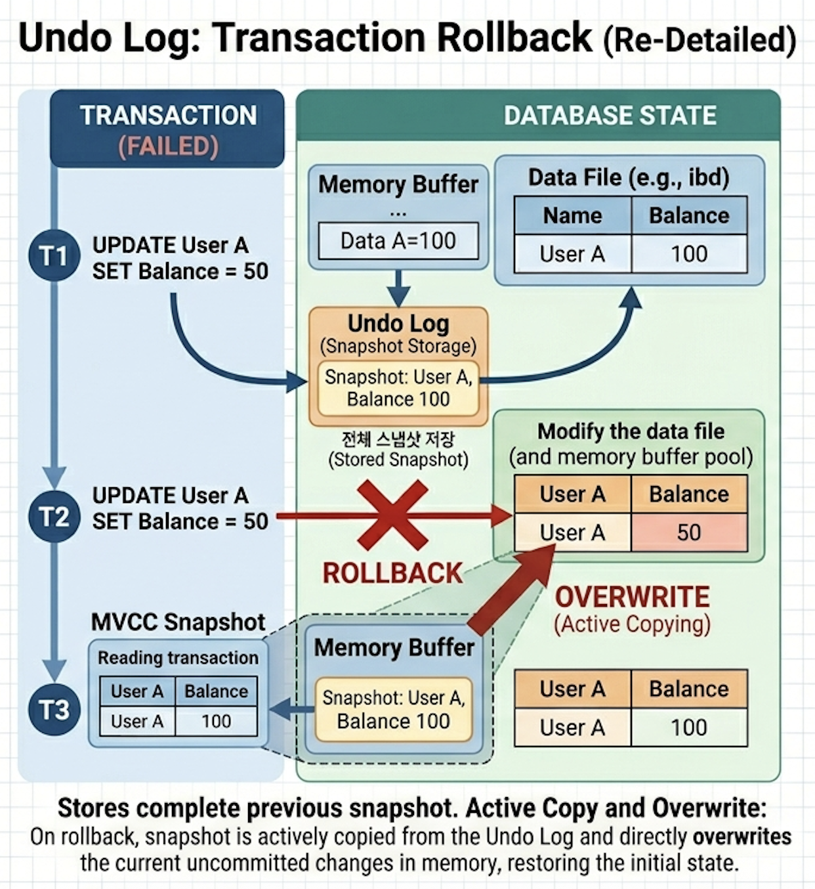
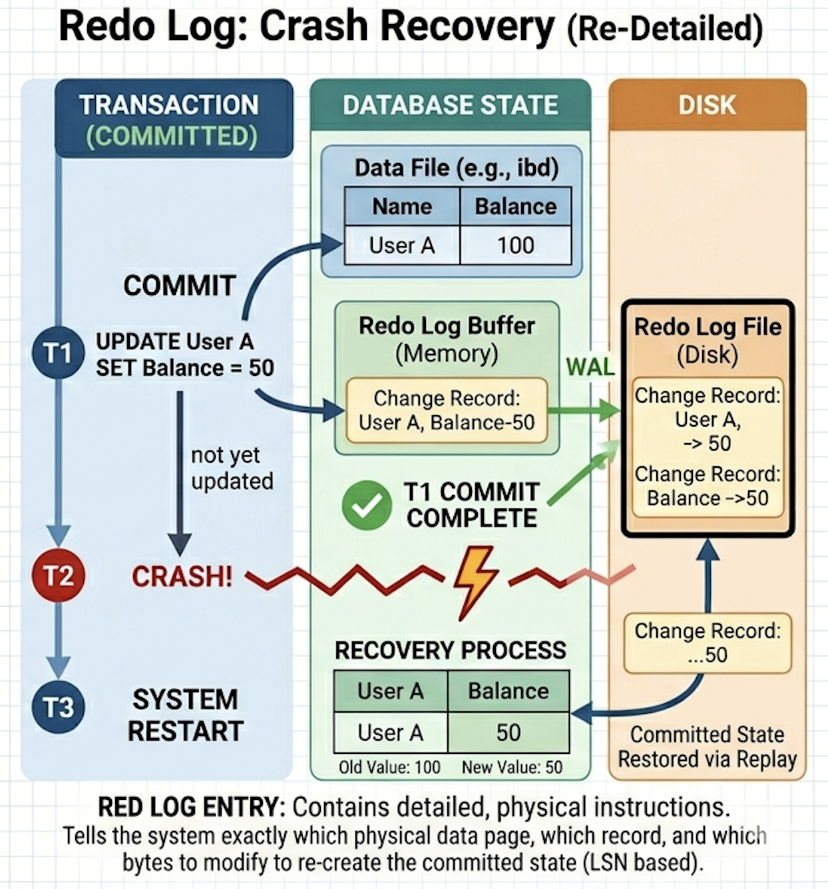

데이터베이스는 트랜잭션의 원자성(Atomicity)과 지속성(Durability)을 보장하기 위해 로그 기반 복구 메커니즘을 사용한다

</br>

**💡 WAL(Write-Ahead Logging)**

WAL은 데이터베이스에서 데이터 파일을 직접 변경하기 전에 변경 내용을 로그에 먼저 기록하도록 강제하는 저장 원칙이다.

→ 데이터보다 로그를 먼저 안전하게 남겨라!

</br>

**왜 필요한가?**

DB는 보통 성능 때문에 데이터를 바로 디스크에 쓰지 않고

“메모리(Buffer Pool)에 먼저 반영 → 나중에 디스크에 flush”

이렇게 동작하는데, 이 과정에서 문제가 생길 수 있음

→ 그래서 변경이 발생하면 먼저 로그에 기록하고 데이터를 변경하도록 하자!

</br>

**장애 상황에서 어떻게 복구되는가?**

- 데이터 일부만 반영 → Undo Log를 통해 rollback
- commit 되었지만 디스크에 반영 X → Redo Log를 통해 재적용

</br>
</br>

**💡 Undo Log**

트랜잭션 수행 중 데이터가 변경되기 전의 이전 값을 기록하는 로그

→ 트랜잭션 실패 시 rollback을 통해 이전 상태로 복구하는 데 사용

→ MVCC 환경에서는 다른 트랜잭션이 과거 데이터를 조회할 때도 활용

</br>

동작 방식



1. 데이터 변경 SQL 발생
2. DBMS가 변경 전 값을 읽어 Undo Log에 저장
3. 실제 데이터 변경 수행
4. 트랜잭션 실패 시 Undo Log를 기반으로 이전 상태로 복구 (rollback)
5. 더 이상 Undo Log가 필요 없어지면 삭제 (purge)
    - commit 완료된 경우
    - 해당 로그를 참조하는 트랜잭션이 없는 경우

</br>
</br>

**💡 Redo Log**

커밋된 트랜잭션의 변경 내용을 기록하는 로그

→ commit은 완료되었지만 디스크 반영이 아직 완료되지 않은 경우, 데이터 유실을 방지하기 위해 사용

</br>

동작 방식



1. 데이터 변경 SQL 발생
2. DBMS가 변경 내용을 Redo Log(Buffer)에 먼저 기록
3. commit 수행 (트랜잭션 성공 확정)
4. 실제 데이터는 이후 디스크에 반영될 수 있음 (지연 반영)
5. 장애 발생 시 Redo Log를 기반으로 변경 내용을 재적용 (replay)

</br>

Redo Log는 어디에 저장될까?

```sql
1. 데이터 변경 발생
   ↓
2. Redo Log Buffer (메모리)에 기록
   ↓
3. commit 시 Redo Log를 디스크에 flush
   ↓
4. 실제 데이터 파일은 나중에 반영 (deferred write)
```

장애 복구에 사용되어야 하기 때문에, Redo Log는 commit 시 무조건 디스크에 남아야 함