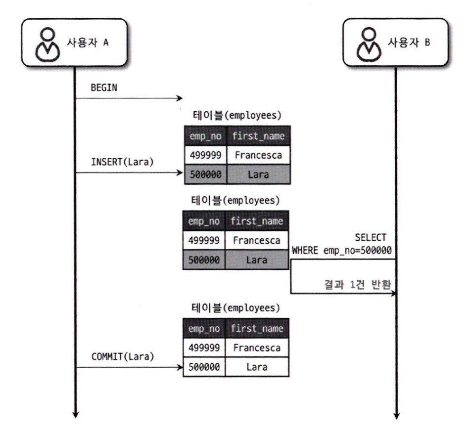
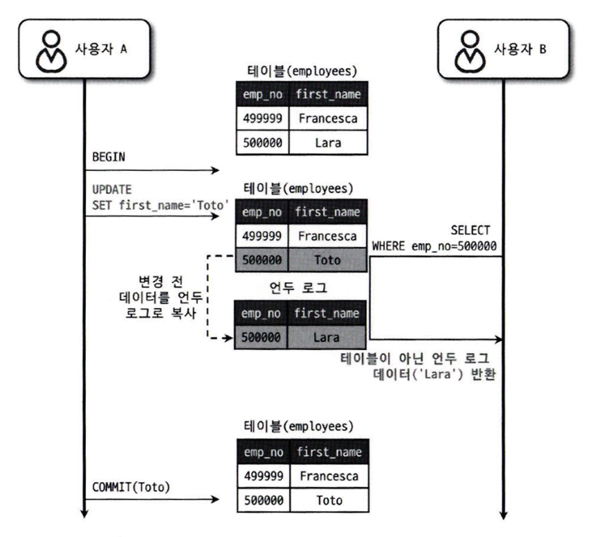
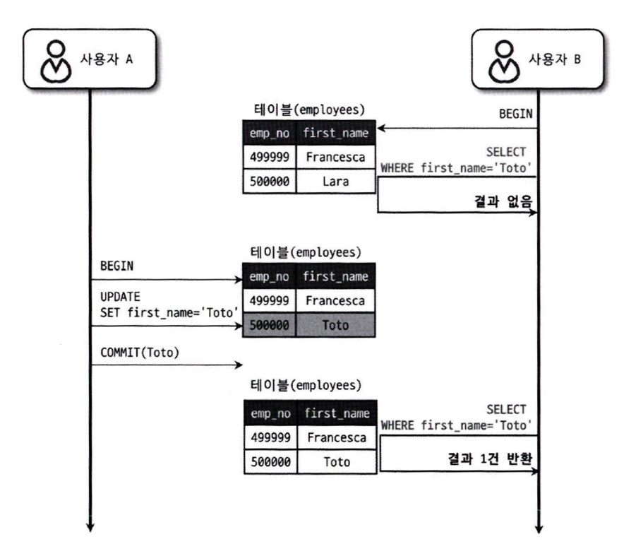

### **Q. 트랜잭션의 격리 수준에 대해 설명해주세요**

트랜잭션의 격리 수준은 동시에 실행되는 트랜잭션 간의 간섭을 어느 정도 허용할지를 결정하는 기준입니다.

크게 Read Uncommitted, Read Committed, Repeatable Read, Serializable 네 가지가 있으며, 격리 수준이 높아질수록 데이터 정합성은 높아지지만 동시성 성능은 낮아지고, 낮아질수록 성능은 좋아지지만 데이터 이상 현상이 발생할 수 있습니다.

각 수준에 따라 Dirty Read, Non-repeatable Read, Phantom Read와 같은 동시성 문제가 발생하거나 방지됩니다.

따라서 서비스의 특성에 따라 정합성과 성능의 균형을 고려해 적절한 격리 수준을 선택하는 것이 중요합니다.

</br>
</br>

1️⃣ **Read Uncommitted**

- 커밋되지 않은 데이터도 읽을 수 있는 격리 수준
- **→ Dirty Read 발생 가능**
    
    

</br>

2️⃣ **Read Committed**

- 커밋된 데이터만 읽을 수 있는 격리 수준
- 중간에 다른 트랜잭션이 조회한다면 Undo Log에 기록된 변경 전 데이터를 반환
- **→ Non-repeatable Read 발생 가능**
    
    
    
    Read Committed 동작 과정
    
    
    
    Non-repeatable Read

1. T2가 SELECT 실행 → read view 생성 (이 시점 기준)
2. 데이터 조회 시
    - 현재 값이 이미 커밋된 값이면 → 그대로 읽음
    - 아직 커밋되지 않은 값이면 → undo log를 따라가 이전 커밋된 값 조회
3. 이후 T1이 커밋
4. T2가 다시 SELECT 실행 → 새로운 read view 생성 (이 시점 기준)
5. 데이터 조회
    - 새 기준(read view)에서는 방금 커밋된 값이 포함됨 → non-repeatable read 발생

<details>
<summary>💡 read view란?</summary>
<div markdown="1">

내 트랜잭션이 조회할 때, 어떤 트랜잭션의 변경까지 볼 수 있는지 정의한 기준표
    
    - 각 데이터에는 이를 생성한 **트랜잭션 ID(trx_id)**가 존재하고
    - Read View는 **조회 가능한 트랜잭션 범위**를 가지고 있음
    - 이 둘을 비교해서 **데이터를 읽을지, 아니면 Undo Log를 따라갈지 결정**
    
    ex) 
    
    📌 **상황**
    
    - T1 → trx_id = 10
    - T2 → trx_id = 20
    
    초기 상태:
    
    ```
    이름 = Lara (trx_id = 5, 이미 커밋됨)
    ```
    
    ---
    
    **1단계: T1이 값 변경**
    
    ```
    Lara → Toto (trx_id = 10, 아직 commit 안 함)
    ```
    
    현재 상태:
    
    - 현재 값: Toto (trx_id = 10)
    - Undo Log: Lara (trx_id = 5)
    
    ---
    
    **2단계: T2 시작 → Read View 생성**
    
    T2의 Read View:
    
    ```
    active trx list = [10]
    ```
    
    의미: trx_id = 10은 아직 진행 중이니까 이 트랜잭션이 만든 데이터는 보면 안 됨
    
    ---
    
    **🔍 데이터 조회 과정**
    
    **1)현재 값 확인**
    
    ```
    Toto (trx_id = 10)
    ```
    
    판단:
    
    - trx_id = 10
    - active list에 포함됨
    
    아직 커밋 안 된 트랜잭션 → 읽으면 안 됨
    
    ---
    
    **2)Undo Log로 이동**
    
    ```
    Lara (trx_id = 5)
    ```
    
    판단:
    
    - trx_id = 5
    - active list에 없음
    - 이미 커밋된 값
    
    읽어도 되는 값 → 최종 반환

</div>
</details>


 </br>   

3️⃣ **Repeatable Read**

- 한 트랜잭션 내에서 동일한 데이터를 여러 번 조회하더라도 항상 같은 결과를 보장
- **→ Phantom Read 발생 가능**
- (이미 조회한 row에 대해서는 스냅샷을 유지해 일관된 값을 보장하지만, 조회 조건에 해당하는 새로운 row의 삽입까지는 제어하지 못하기 때문에 Phantom Read 발생 가능)

1. T2 트랜잭션 시작 → read view 생성 (고정)
2. 첫 SELECT 실행
    - 현재 값이 read view 기준에 맞으면 → 읽음
    - 아니면 → undo log를 따라가서 맞는 버전 조회
3. 이후 T1이 커밋
4. T2가 다시 SELECT 실행 → read view 그대로
5. 데이터 조회
    - 처음 생성된 read view 기준으로 판단 → 여전히 이전 값 조회(undo log 활용)


</br>

4️⃣ **Serializable**

- 가장 높은 격리 수준으로, **트랜잭션을 순차적으로 실행**하는 것과 동일하게 동작
- 모든 이상 현상을 방지하지만, 동시성이 크게 떨어져 성능 저하 발생

</br>
</br>

**💡 트랜잭션 격리 수준별 추천 상황**

| 격리 수준 | 특징 | 발생 가능 문제 | 추천 상황 | 선택 이유 |
| --- | --- | --- | --- | --- |
| **Read Uncommitted** | 커밋되지 않은 데이터도 읽음 | Dirty Read | 로그 분석, 통계성 데이터 조회 | 데이터 정확도가 크게 중요하지 않고, 성능이 더 중요한 경우 |
| **Read Committed** | 커밋된 데이터만 조회 (매 조회마다 기준 갱신) | Non-repeatable Read, Phantom Read | 게시글 조회, 상품 리스트, 뉴스 피드, 일반 조회 API | 최신 데이터 반영 + 성능 우수, 대부분의 조회 서비스에 적합 |
| **Repeatable Read** | 트랜잭션 시작 시점 기준 유지 (일관성 보장) | Phantom Read | 결제 처리, 재고 관리, 예약 시스템, 계좌 처리 | 트랜잭션 내 데이터 변경 방지 → 안정적인 비즈니스 로직 가능 |
| **Serializable** | 트랜잭션을 순차 실행처럼 처리 | 없음 (완전한 정합성) | 금융 시스템, 정산 처리, 중요한 배치 작업 | 데이터 정합성 100% 보장 (대신 성능 비용 매우 큼) |

**💡 MySQL에서 설정 방법**

MySQL의 InnoDB 스토리지 엔진의 경우 기본 격리 수준은 Repeatable Read이다.

현재 격리 수준 확인

```
SELECT @@transaction_isolation;
```

세션 단위 설정

→ 현재 연결(세션)에만 적용됨

```
SETSESSIONTRANSACTIONISOLATIONLEVELREAD COMMITTED;
```

전역 설정

→ DB 전체 기본값 변경 (보통 운영에서는 잘 안 건드림)

```
SETGLOBALTRANSACTIONISOLATIONLEVEL REPEATABLEREAD;
```

트랜잭션 단위 설정

→ 특정 트랜잭션에만 적용

```
SETTRANSACTIONISOLATIONLEVEL SERIALIZABLE;

STARTTRANSACTION;
-- 쿼리 실행
COMMIT;
```

**💡 SpringBoot 에서 설정 방법**

Spring은 따로 설정 안하면 DB 기본값을 따라간다.

기본 사용

```java
@Transactional(isolation=Isolation.READ_COMMITTED)
publicvoidmyMethod() {
	// 비즈니스 로직
}

@Transactional(isolation = Isolation.REPEATABLE_READ)
@Service
public class PaymentService {
}
```

옵션 종류

```
Isolation.READ_UNCOMMITTED
Isolation.READ_COMMITTED
Isolation.REPEATABLE_READ
Isolation.SERIALIZABLE
```