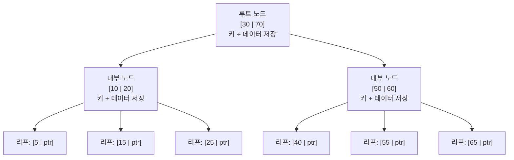
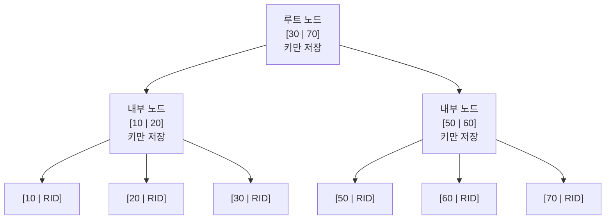
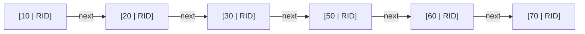
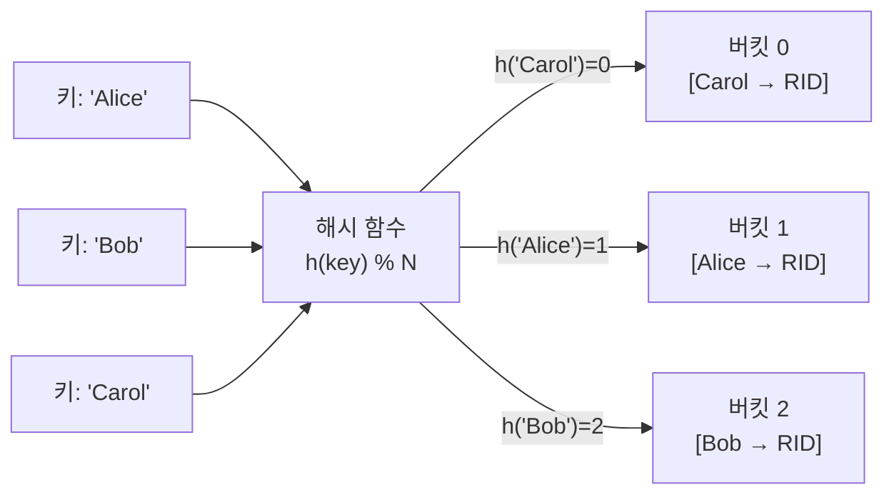
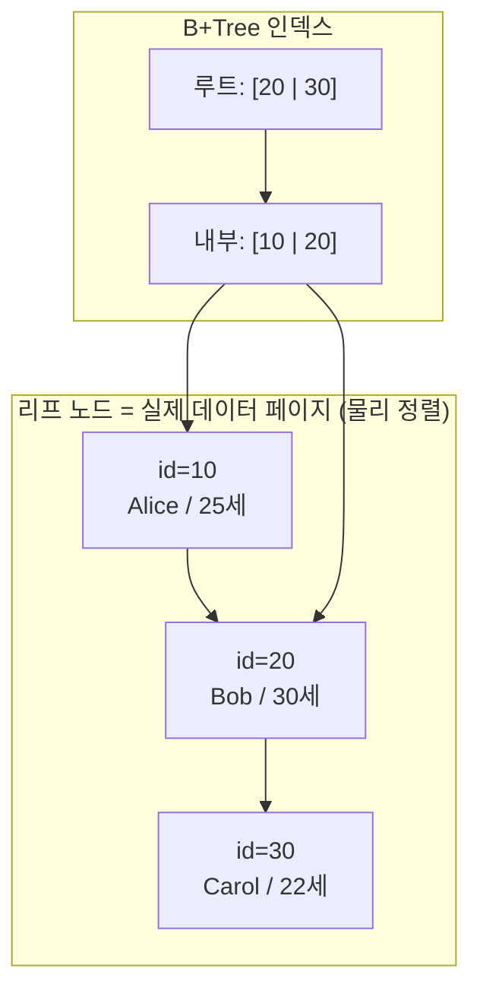
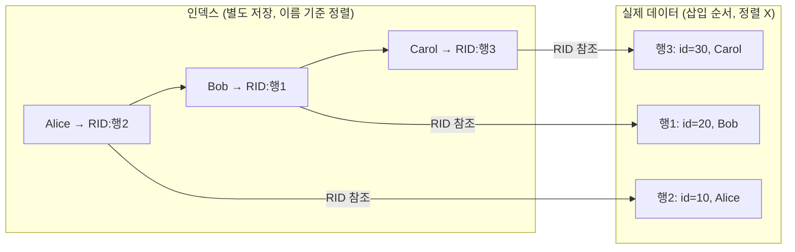
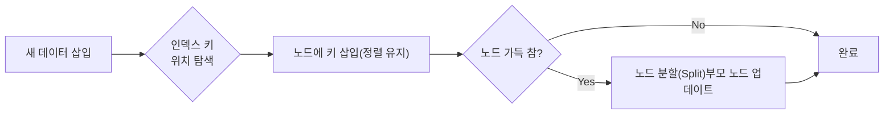
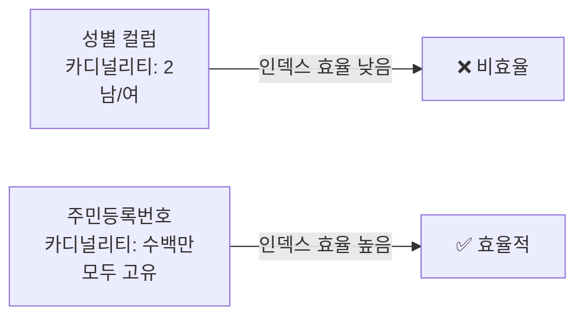

# 인덱스의 특징에 대해 아는 대로 말해보세요.

> 이 부분에서는 전체적인 인덱스에 대해서 다시 설명하고 넘어가겠습니다.

🖐️ 인덱스란 데이터 베이스 검색 속도를 높이기 위해 특정 컬럼 기준으로 미리 정렬해 관리하는 별도 테이블 구조입니다.

🖐️ 가장 큰 장점은 `SELECT` 쿼리에서 `WHERE` 이나 `ORDER BY`같은 조건절이나 정렬을 처리할 때, 전체 테이블을 스캔하지 않아도 데이터에 빠르게 접근할 수 있습니다.

🖐️ 반면 인덱스를 저장하기 위한 추가 물리 공간과 데이터 변경이 발생 시 인덱스 구조를 실시간 정렬과 갱신이 필요해 쓰기 성능이 저하될 수 있습니다.

🖐️ 그렇기에 인덱스는 데이터 중복도가 낮고 조회 빈도가 높은 컬럼 중심으로 설계해야 합니다.

## 1. 인덱스의 정의와 목적

- 인덱스란 데이터베이스 테이블에서 **검색 속도**를 높이기 위해 **별도로** 관리하는 **데이터 구조**입니다.

- 인덱스는 특정 컬럼의 값과 해당 값이 저장된 테이블 행(ROW)의 **물리적 주소(RID/TID)**를 쌍으로 제공합니다.

- 인덱스의 가장 큰 특징은 항상 **정렬된 상태를 유지**한다는 것입니다.

- 그렇기에 이진 탐색과 유사한 방식으로 데이터를 찾아낼 수 있습니다.

- 대부분의 RDBMS는 B+Tree 구조를 사용합니다.

- 그 이유는 모든 Leaf Node가 **Linked List**로 연결되어 범위 Scan 에 유리하기 때문입니다.

## 2. 인덱스의 자료구조

### 2-1. B-Tree

모든 노드(루트, 내부, 리프)에 **키와 데이터 포인터를 함께 저장**합니다.

- 탐색 시 내부 노드에서도 데이터를 찾을 수 있습니다.

- 범위 검색 시 매번 루트부터 다시 탐색해야 하므로 비효율적입니다.

> 단점: L3 다음 L4를 찾으려면 다시 루트(R)로 올라가야 합니다.

---

### 2-2. B+Tree

**내부 노드에는 키만** 저장하고, **리프 노드에만 실제 데이터 포인터**를 저장합니다.
리프 노드끼리 **Linked List**로 연결되어 범위 검색(Range Scan)에 매우 유리합니다.

**[ 트리 구조 ]**

**[ 리프 노드 Linked List — 범위 검색 시 순차 탐색 ]**

> 장점: 범위 조건(`BETWEEN`, `>`, `<`)에서 리프 노드만 순차 탐색하면 됩니다.

---

### 2-3. Hash Index

해시 함수로 키를 **버킷 Bucket**에 매핑합니다.

- **등치 조건(`=`)** 검색에서 O(1)로 매우 빠릅니다.
- 해시 결과는 정렬이 무의미하므로 **범위 검색 불가**합니다.
- Memory Storage Engine(MEMORY), Redis 등에서 활용합니다.

---

## 3. 클러스터형 vs 비클러스터형

### 클러스터형 인덱스 (Clustered Index)

- 테이블 데이터 자체가 인덱스 키 순서대로 **물리적으로 정렬**됩니다.
- 리프 노드 = 실제 데이터 페이지 (별도 이동 없음)
- 테이블당 **1개만** 존재 가능 (MySQL InnoDB에서는 PK가 자동으로 클러스터형)

---

### 비클러스터형 인덱스 (Non-Clustered Index)

- 인덱스와 실제 데이터가 **별도로 저장**됩니다.
- 리프 노드에 실제 행의 주소(RID)를 저장 후, 해당 주소로 이동(추가 I/O 발생)합니다.
- 테이블당 **여러 개** 생성 가능합니다.

| 구분 | 클러스터형 | 비클러스터형 |
|------|-----------|-------------|
| 데이터 정렬 | 물리적으로 정렬됨 | 정렬 없음 |
| 리프 노드 | 실제 데이터 페이지 | RID(행 주소) |
| 개수 제한 | 테이블당 1개 | 여러 개 가능 |
| 범위 검색 | 매우 빠름 | 상대적으로 느림 |
| 추가 I/O | 없음 | RID로 추가 조회 필요 |

---

## 4. 인덱스 관리 비용

인덱스는 항상 **정렬 상태를 유지**해야 하므로, 데이터 변경 시 추가 작업이 발생합니다.

### 4-1. INSERT

- 삽입 위치를 탐색하고, 정렬 순서를 유지하며 키를 삽입합니다.
- 노드가 가득 찰 경우 **노드 분할(Split)** 이 발생하여 비용이 증가합니다.

### 4-2. UPDATE

- 인덱스가 걸린 컬럼을 수정하면, **기존 키 삭제 → 새 키 삽입** 두 단계로 처리됩니다.
- UPDATE = DELETE + INSERT (비용 2배)

### 4-3. DELETE

- 인덱스에서 해당 키를 삭제합니다.
- 노드의 키가 너무 적어지면 **노드 병합(Merge)** 이 발생합니다.
- 실제로는 즉시 삭제하지 않고 **삭제 마크(Soft Delete)** 처리 후 나중에 정리하기도 합니다.

---

## 5. 인덱스 설계 원칙

### Cardinality (카디널리티)

- 컬럼의 **고유한 값의 수**를 의미합니다.
- 카디널리티가 높을수록 인덱스 효율이 좋습니다.

### Selectivity (선택도)

- `선택도 = 고유값 수 / 전체 행 수`
- 선택도가 **낮을수록(고유값 많을수록)** 인덱스가 효과적입니다.
- 일반적으로 선택도 **5~10% 이하**인 컬럼에 인덱스를 권장합니다.

> 예: 1,000만 건 중 `WHERE gender = '남'` → 약 500만 건 반환 → 선택도 50% → 인덱스보다 Full Scan이 빠를 수 있음
