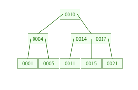
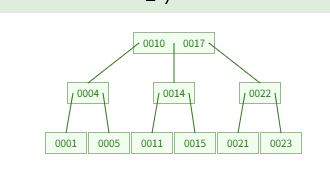

## B-Tree란?

> 이는 B Tree의 다른 말 입니다.

트리 자료구조의 하나로 이진 트리를 확장해 하나의 노드가 가질 수 있는 **자식 노드의 최대 숫자가 2보다 큰 트리 구조**입니다.
인덱스는 SEARCH에 최적화를 위해 걸기 때문에 자식 노드가 단 2개라면 검색에 시간이 오래 걸려 이를 사용했습니다.
 
 
일단 핵심은 **Self-Balancing** 과 **Disk I/O** 가 핵심입니다.
 
 
일반적인 이진 트리의 경우 데이터가 한 쪽에 쏠리면 `LinkedList` 처럼 길어져 탐색 속도가 O(n)까지 떨어질 수 있습니다.
 
반면 B 트리의 경우 **어떤 데이터를 찾더라도 루프에서 리프까지의 거리가 항상 동일** 하다는 것이 가장 큰 특징입니다.
 
 

### B-Tree의 특징

1. 노드에는 **2개 이상의 데이터**가 들어갈 수 있고, 항상 정렬된 상태로 저장됩니다.
2. 내부 노드는 `ceil(M/2) ~ M` 개의 자식을 가질 수 있습니다. 최대 M 개의 자식을 가질 수 있는 B 트리는 M 차 B 트리입니다.
3. 특정 노드의 데이터가 K 개라면, 자식 노드 수는 K+1 이어야 합니다.
4. 특정 노드의 왼쪽 서브 트리는 특정 노드의 Key 보다 작은 값들로, 오른쪽 서브 트리는 큰 값들로 구성되어 있습니다.
5. 노드 내에 데이터는 `ceil(M/2)-1`개부터 최대 `M-1`개까지 포함될 수 있습니다.
6. 모든 리프 노드들이 같은 레벨에 존재합니다.
 
 
 
참고로 `ceil`은 반올림 함수 입니다.
 
 

지금 저는 3차 B 트리에 값을 임의로 넣어봤습니다.

여기서 23을 넣으면 어떻게 될까요?

1. 루트 10을 봅니다.

- 이보다 크니 오른쪽으로 이동!

2. 14와 17을 봅니다.

- 이보다 크니 오른쪽으로 이동!

3. 21을 봅니다.

- 이보다 크니 오른쪽에 일단 붙입니다.
- 3차니 루트는 최대 2개까지 가능하므로 옆에 붙을 수 있습니다.

여기서 22를 넣어볼까요?

위와 똑같은 과정을 거칩니다.

단, 21 - 22 - 23 으로 넣는다면 3개는 들어갈 수 없으므로 **대신 위로 올립니다.**

14-17-22 또한 3개이므로 **위로 다시 올립니다.**

대신 우리는 중간 값인 17을 올릴 것 입니다.

이에 따라 10 옆에 17이 붙고 아래와 같은 그림이 될 것 입니다.

이해가 안된다면 하단의 링크로 B-Tree의 삽입, 삭제, search 를 그림으로 볼 수 있습니다.

# 한 줄 정리
> B 트리는 이진 트리를 확장해 하나의 노드가 여러 데이터를 가질 수 있도록 설계된 자가 균형 탐색 트리입니다.
> 가장 큰 특징은 모든 리프 노드가 동일 레벨에 존재한다는 것 입니다.
> 이를 통해 데이터가 치우치는 것을 막고, 어떤 데이터를 찾더라도 동일 탐색 시간을 보장합니다.
> 또한 하나의 노드에 여러 데이터를 담아 한 번의 디스크 접근으로 많은 정보를 읽을 수 있어 Disk IO에 효율적입니다.
> 노드 내 데이터가 K 개일 때 자식 노드 수가 항상 K+1 개가 되도록 유지하며 삽입, 삭제 시 노드 분할과 병합으로 스스로 균형을 맞추기에 대량의 데이터를 다루는 데이터베이스 인덱스 구조로 사용됩니다.

### 참고 자료
[B-Tree 만들기](https://www.cs.usfca.edu/~galles/visualization/BTree.html)